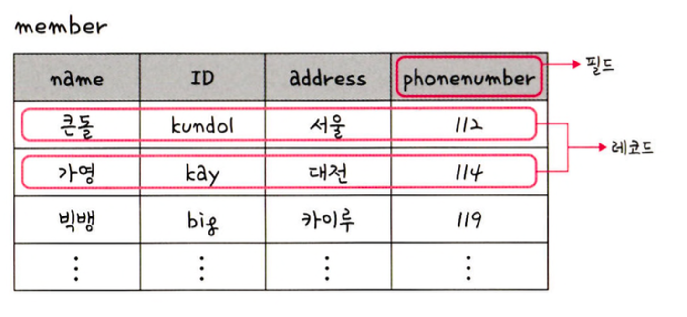
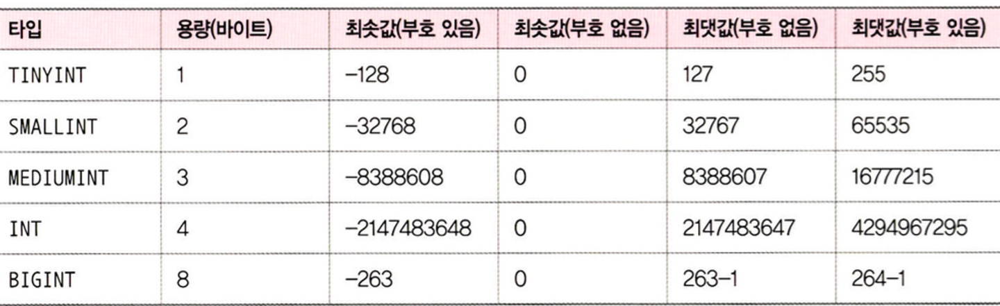
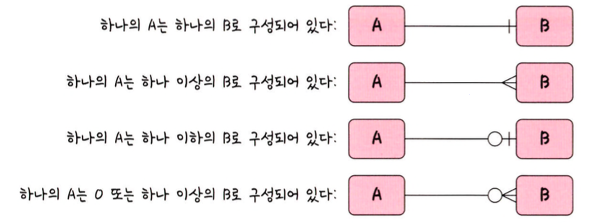
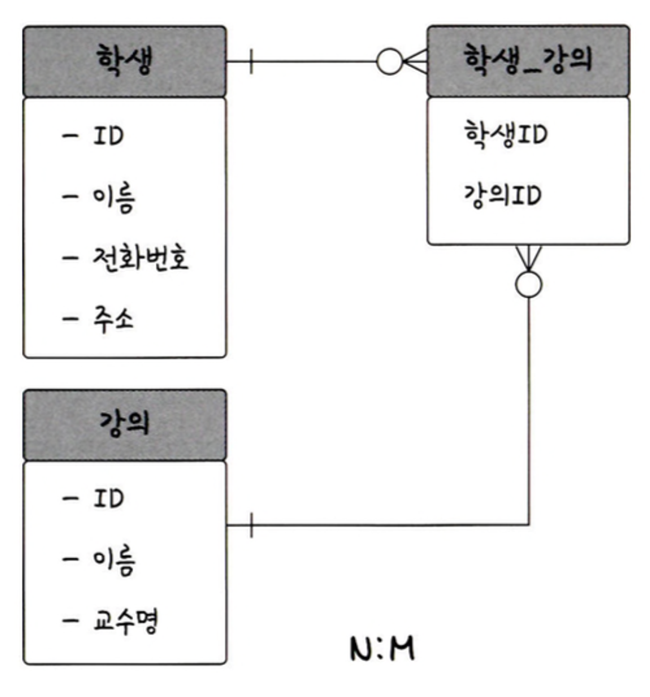
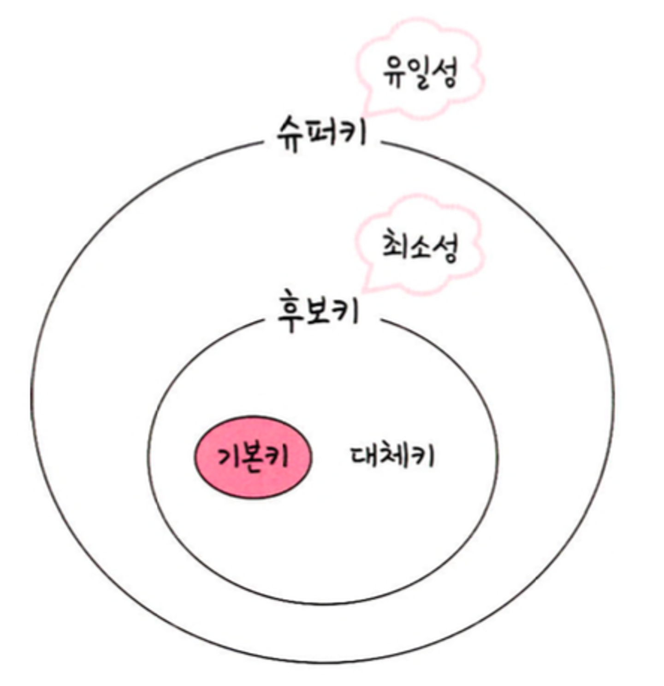

# 데이터베이스

데이터베이스 : 일정한 규칙, 혹은 규약을 통해 구조화되어 저장되는 데이터의 모음. 해당 데이터베이스를 제어, 관리하는 통합 시스템을 DBMS(DataBase Management System)라고 하며, 데이터베이스 안에 있는 데이터들은 특정 DBMS마다 정의된 쿼리 언어를 통해 삽입, 삭제, 수정, 조회 등을 수행할 수 있다. 또한 데이터베이스는 실시간 접근과 동시 공유가 가능하다

응용 프로그램 ↔ DBMS ↔ 데이터베이스

응용 프로그램 - Node.js, Java

DBMS - MySQL

응용프로그램에서 데이터베이스 안에 있는 데이터를 이용해서 해당 데이터 관련 로직을 구축할 수 있다

## 엔티티

사람, 장소, 물건, 사건, 개념 등 여러 개의 속성을 지닌 명사를 의미

회원 엔티티 - 이름, 아이디, 주소, 전화번호의 속성을 가진다

### 약한 엔티티와 강한 엔티티

A가 혼자서 존재하지 못하고 B의 존재 여부에 따라 종속적이라면 A는 약한 엔티티, B는 강한 엔티티가 된다. 

ex) 방 - 약한 엔티티, 건물 - 강한 엔티티

### 릴레이션

데이터베이스에서 정보를 구분하여 저장하는 기본 단위. 엔티티에 관한 데이터를 데이터베이스는 릴레이션 하나에 담아서 관리한다

관계형 데이터베이스 - 테이블

NoSQL - 컬렉션

### 테이블과 컬렉션

- 관계형 데이터베이스 MySQL : 레코드-테이블-데이터베이스
- NoSQL MongoDB : 도큐먼트-컬렉션-데이터베이스

### 속성

릴레이션에서 관리하는 구체적이며 고유한 이름을 갖는 정보

ex) 차(엔티티)의 속성에는 차 넘버, 바퀴 수, 차 색깔, 차 종 등이 있다

이 중 서비스의 요구 사항을 기반으로 관리해야 할 필요가 있는 속성들만 엔티티의 속성이 된다

### 도메인

릴레이션에 포함된 각각의 속성들이 가질 수 있는 값의 집합

ex) 성별(속성) - {남,여}(도메인)

### 필드와 레코드



회원 (엔티티)

member (테이블)

이름, 아이디 (속성)

name, ID, address (필드)

테이블에 쌓이는 행(row) 단위의 데이터를 레코드(=튜플) 라고 한다

엔티티를 데이터베이스에 넣어 테이블로 만들기 위해선 속성에 맞는 타입을 정의해야 한다.

ex) 책의 아이디 : INT, 책의 제목 : VARCHAR … 

```sql
CREATE TABLE book(
	id INT NOT NULL AUTO_INCREMENT,
	title VARCHAR(255)
);
```

- 필드 : 타입을 갖는다. 이름 - 문자열, 전화번호 - 숫자
    - 숫자 : TINYINY, MEDIUMINT, INT, BIGINT 등
        
        
        
    - 날짜
        - DATE : 날짜 부분은 있지만 시간 부분은 없는 값에 사용. 1000-01-01 ~ 9999-12-31. 3byte
        - DATETIME : 날짜 및 시간 부분을 모두 포함하는 값에 사용. 1000-01-01 00:00:00 ~ 9999-12-31 23:59:59. 8byte
        - TIMESTAMP : 날짜 및 시간 부분을 모두 포함하는 값에 사용. 1970-01-01 00:00:01 ~ 2038-01-19 03:14:07. 4byte
    - 문자 : CHAR, VARCHAR 모두 그 안에 수를 입력해서 몇 자까리 입력할지 정한다. ex) CHAR(30) : 최대 30글자까지 입력
        - CHAR : 테이블을 생성할 때 선언한 길이로 고정. 길이는 0에서 255 사이의 값을 가진다. 레코를 저장할 때 무조건 선언한 길이 값으로 ‘고정’
        - VARCHAR : 가변 길이 문자열. 길이는 0에서 65,535 사이의 값으로 지정. 입력된 데이터에 따라 용량을 가변시켜 저장한다.
        ex) 10글자에 해당하는 바이트 + 길이 기록용 1바이트
        
        CHAR - 유동적이지 않은 길이응 데이터의 경우 효율적, VARCHAR - 유동적인 길이를 가진 데이터에 효율적
        
        - TEXT : 큰 문자열 저장. ex) 게시판의 본문
        - BLOB : 이미지, 동영상 등 큰 데이터 저장. 그러나 S3를 이용하면 파일에 관한 경로를 VARCHAR로 저장한다
        
        ENUM, SET은 모두 문자열을 열거한 타입
        
        - ENUM : ENUM(’x-small’, ‘small’, ‘medium’ … ) 형태로 사용. 이 중 하나만 선택하는 단일 선택만 가능하고 이넘 리스트에 없는 잘못된 값을 삽입하면 빈 문자열이 대신 삽입된다. 이넘을 이용하면 x-small 등이 0,1 등으로 매핑되어 메모리를 적게 사용한다. 최대 65,535개의 요소 삽입 가능
        - SET : 여러 개의 데이터를 선택할 수 있고 비트 단위의 연산을 할 수 있으며 최대 64개의 요소를 집어넣을 수 있다
        
        장점 : ENUM, SET을 사용할 경우 공간적으로 이점
        단점 : 애플리케이션의 수정에 따라 데이터베이스의 ENUM이나 SET에서 정의한 목록을 수정해야 한다
        

### 관계



- 1:1 관계 : 테이블을 두 개의 테이블로 나눠 테이블의 구조를 더 이해하기 쉽게 만들어 준다
- 1:N 관계 : 한 유저당 여러 개의 상품을 장바구니에 넣을 수 있다. 하나도 넣지 않는 0개의 경우도 있으니 0도 포함되는 화살표를 통해 표현해야 한다
- N:M 관계 : 학생도 강의를 많이 들을 수 있고 강의도 여러 명의 학생을 포함할 수 있다. N:M은 테이블 두 개를 직접 연결해서 구축하지 않고 1:N, 1:M 관계를 갖는 테이블 두 개로 나눠 설정한다
    
    
    

### 키

테이블 간의 관계를 조금 더 명확하고 테이블 자체의 인덱스를 위해 설정된 장치



슈퍼키 - 유일성, 그 안에 포함된 후보키는 최소성까지 갖춘 키, 후보키 중에서 기본키로 선택되지 못한 키는 대체키가 된다. 유일성을 중복되는 값은 없으며, 최소성을 필드를 조합하지 않고 최소 필드만 사용해서 키를 형성할 수 있다

- 기본키 : PK, 프라이머리키. 유일성과 최소성을 만족한다. 기본키에 해당하는 데이터는 중복을 허용하지 않는다. 복합키를 기본키로 설정하면 최소성을 만족하지 않는다. 기본키는 자연키 또는 인조키 중 골라 설정한다
- 자연키 : 중복된 값들을 제외하며 중복되지 않는 것을 뽑아서 나오는 키를 자연키라고 한다. 언젠가는 변하는 속성을 가진다.
- 인조키 : 오라클 - sequence, MySQL - auto_increment 등으로 설정. 인위적으로 생성한 키를 인조키라고 한다. 자연키와는 반대로 변하지 않는다. 따라서 보통 기본키는 인조키로 설정한다
- 외래키 : FK, 다른 테이블의 기본키를 그대로 참조하는 값. 개체와의 관계를 식별하는 데 사용된다. 중복 허용
- 후보키 : 기본키가 될 수 있는 후보들, 유일성과 최소성을 동시에 만족하는 키
- 대체키 : 후보키가 두 개 이상일 경우 어느 하나를 기본키로 지정하고 남은 후보키들을 말한다
- 슈퍼키 : 각 레코드를 유일하게 식별할 수 있는 유일성을 갖춘 키


## 🤔 생각해볼 점

- PK는 자연키나 인조키 중에 설정할 수 있다

자연키는 중복된 값을 제외하고 중복되지 않는 값을 뽑아서 나오는 키라고 한다. 예를 들어 회원 테이블에서 회원 정보 중 ‘아이디’ 속성을 자연키로 설정한다. 이메일은 데이터베이스 레코드 상에선 유니크하지만 현실에선 바뀔 수 있는 값이다.(물론 수정을 허용하지 않으면 유일할 수 있다) 그래서 보통 변하지 않는 인조키로 설정하는 것 같다. 생각해보면 데이터베이스를 설계할 때도 삭제하고 검색하기 용이한 값으로 PK를 지정했던 것 같다.

게시판에서 글을 삭제할 땐 글의 번호, 회원 정보를 삭제 할 땐 회원의 아이디로 검색하는데, 테이블이 매핑되어있기 때문에 삭제할 때 관련 속성을 사용했다.

```java
@DeleteMapping("/api/products/{productId}")
    public ResponseEntity<String> delete(@Login User user, @PathVariable Integer productId) {
        if (productId == null) {
            throw new IllegalArgumentException("상품 ID가 유효하지 않습니다.");
        }
        productService.deleteProduct(productId);
        return new ResponseEntity<>(ResponseMessage.DELETE_PRODUCT_OK, HttpStatus.OK);
    }
```

```java
@Transactional
    public void deleteProduct(Integer productId) {
        Product product = findProductByProductId(productId);
        product.setDeleted(true);
        productRepository.save(product);
    }
```

팀 프로젝트에서 구현 당시 soft delete를 사용했기때문에 완전 삭제를 해주진 않았다.

검색을 할 때도 유저의 아이디를 기반으로 상품 테이블에서 찾았다.

```java
public ProductListDTO getUserSalesProducts(User user, Pageable pageable, ProductSearchCondition productSearchCondition) {
        User savedUser = userRepository.findById(user.getUserId())
                .orElseThrow(() -> new IllegalArgumentException("존재하지 않는 회원입니다"));
        productSearchCondition.setUserId(savedUser.getUserId());

        Slice<Product> productsWithSlice = productRepository.findFilteredProducts(pageable, productSearchCondition);
        List<Product> products = productsWithSlice.getContent();

        return new ProductListDTO(products.stream()
                .map(ProductDTO::new)
                .collect(Collectors.toList()), productsWithSlice.hasNext());
    }
```

테이블 설계 당시 userId를 auto_increment로 설정했기때문에 (깃허브 로그인을 사용해서 나머지는 이름과 아바타만 가져왔다) 검색하고 삭제하기 용이했던 것 같다. 자연키를 PK로 두는 회사에 간다면 아마 그만한 이유가 있지 않을까? 라고 생각한다.